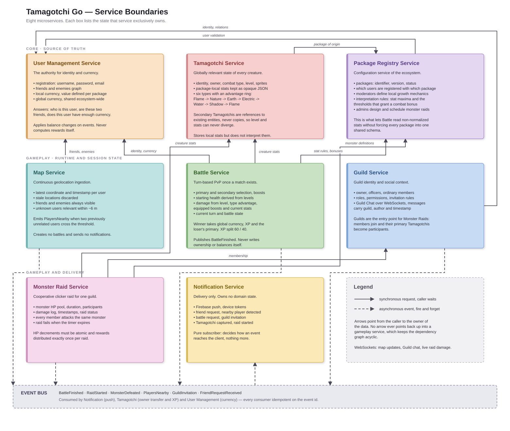

# Tamagotchi Go

Backend-as-a-Service ecosystem for third-party Tamagotchi apps ("packages"). Each package ships its
own creatures, art and local growth mechanics, while a shared backend lets users from different
packages meet, battle, trade creatures, form guilds and fight cooperative monster raids.

---

## Table of Contents

- [Service Boundaries](#service-boundaries)
- [Architecture Diagram](#architecture-diagram)
- [Technologies and Communication Patterns](#technologies-and-communication-patterns)
- [Communication Overview](#communication-overview)
- [Communication Contract](#communication-contract)
- [Open Boundary Decisions](#open-boundary-decisions)
- [Contribution Workflow](#contribution-workflow)

---

## Service Boundaries

Eight microservices. Each one owns a single slice of state and is the **only** writer of that slice;
everything else reads it through an API or reacts to its events.

| # | Service          | Owns (single source of truth)                                                              | Explicitly does **not** own                               |
| - | ---------------- | ------------------------------------------------------------------------------------------ | -------------------------------------------------------- |
| 1 | User Management  | accounts, credentials, friends/enemies, local + global currency balances                   | creature state, battle math, geolocation                 |
| 2 | Tamagotchi       | creature entities, owner reference, combat type, level, sprites, raw package-local stats   | interpretation of those stats, damage formulas, currency |
| 3 | Package Registry | packages, versions, moderators/admins, stat *definitions*, monster & raid *definitions*    | user identity, live raid state                           |
| 4 | Battle           | PvP match runtime: state, turns, damage, outcome                                           | creature ownership record, currency balances             |
| 5 | Map              | latest known coordinates per user, proximity detection                                     | notification delivery, battle creation                   |
| 6 | Notification     | device tokens, delivery preferences, push dispatch                                         | any domain state whatsoever                              |
| 7 | Guild            | guilds, membership, roles, permissions, guild chat messages                                | raid mechanics, user identity                            |
| 8 | Monster Raid     | raid runtime: monster HP, participants, damage log, status                                 | monster definitions, guild membership, currency          |

### 1. User Management Service

The authority for identity. Answers three questions for the whole system: *who is this user*,
*are these two users friends or enemies*, and *does this user have enough global currency*.

Stores registration data (username, password hash, email), the social graph, and both currencies —
local currency, whose value and acquisition are package-specific, and global currency, shared across
the ecosystem and earned mainly through battles and raids.

It never computes rewards. Battle and Raid tell it *what happened*; it applies the balance change.

### 2. Tamagotchi Service

Owns every creature in the ecosystem. A user has one **primary** Tamagotchi, provided by the package
they installed, and may acquire **secondary** ones originating from other users and packages.

Secondary Tamagotchis are **references to existing entities, never copies** — copying would let level
and stats diverge between the original and the reference.

Local health statistics (hunger, tiredness, happiness, energy, discipline, …) are stored as an
opaque, non-normalized document. This service persists them but does not know what they mean.

Combat types form a fixed advantage ring:

```
Flame → Nature → Earth → Electric → Water → Shadow → Flame
```

### 3. Package Registry Service

The configuration service of the ecosystem. Stores package identity, version, description, status
and associated developers.

**Moderators** are package-scoped privileged users who define their package's local growth mechanics
and the *interpretation rules* for its statistics — maximum values, and thresholds that grant a
combat bonus. This is what makes non-normalized stats usable: Battle asks the Registry how to read a
number instead of forcing every package into a shared schema.

**Admins** are globally privileged and design monster raids: monster name, sprites, max HP, combat
stats, weaknesses, resistances, duration, participant limits and reward configuration.

### 4. Battle Service

Executes turn-based PvP after a match is created. Each player picks a primary and a secondary
Tamagotchi and may equip battle boosts.

Damage is derived from primary/secondary level, type advantage, equipped boosts and current health
stats. Starting health derives from Tamagotchi levels.

On completion: the winner receives global currency, XP and **the loser's primary Tamagotchi**; the
loser loses global currency and receives a smaller amount of XP. XP is split between primary and
secondary by a fixed rule (60/40).

The ownership transfer is not written by this service. Battle publishes the outcome; Tamagotchi
reassigns the owner and User Management adjusts balances, both keyed on `battleId` for idempotency.

### 5. Map Service

Ingests a continuous stream of geolocation updates, keeps only the latest coordinate and timestamp
per user, and discards stale locations.

Friends and enemies are always visible on the map. Unknown users become relevant only within a
proximity threshold of roughly 6 metres. When two previously unrelated users cross that threshold,
the service emits a proximity event.

It does not create battles and does not send notifications — it only reports that two people are
near each other.

### 6. Notification Service

A pure subscriber. Other services publish domain events; this service decides how each event reaches
the client and dispatches it through Firebase push.

Delivers: friend request received, nearby player detected, battle request received, another player
used or captured a Tamagotchi, guild invitation, raid started.

### 7. Guild Service

Owns guild identity, membership, roles and permissions (owner/leader, officers, members), and
provides real-time **Guild Chat** over WebSockets — messages carry a guild, an author and a
timestamp.

Guilds are the social context for Monster Raids: members join an active raid and their primary
Tamagotchis become participants. Membership and invitation rules resolve identity and relationships
through User Management.

### 8. Monster Raid Service

Runs cooperative clicker-style raids in which a guild collectively fights one monster with a large
HP pool and a fixed duration.

Any eligible guild member contributes their primary Tamagotchi. Every participant deals damage to
the same monster; the service maintains current monster HP, participants, damage dealt, timestamps
and raid status. A raid fails when its timer expires.

Because the whole guild hits one counter concurrently, HP decrements must be atomic, and reward
distribution must fire exactly once per raid.

---

## Architecture Diagram

Each box lists the state its service exclusively owns. Solid arrows are synchronous requests, dashed
arrows are asynchronous events. Arrows point from the caller toward the owner of the data.



Two properties are worth pointing out, because they are the reason the boundaries are drawn this
way:

**The dependency graph is acyclic.** Nothing in the core layer calls back up into a gameplay
service. Battle reads from Tamagotchi, Registry and User Management, but none of them knows Battle
exists — they learn about a finished fight from an event, not a call.

**Nobody writes to state they do not own.** Battle decides who won, but Tamagotchi performs the
owner transfer and User Management applies the currency change, both keyed on `battleId` so a
redelivered event cannot hand over the same creature twice.

---

## Technologies and Communication Patterns

The implementation deliberately uses exactly **two languages: Go and Python**. Go is assigned to
the services whose load is dominated by concurrent requests, timers or latency-sensitive state
transitions. Python with FastAPI is assigned to data-oriented services where flexible JSON models,
validation and third-party SDK integration matter more than raw throughput. Splitting the services
four-to-four gives the team meaningful experience in both stacks without introducing a third
language or a unique stack for every service.

### Shared infrastructure and contracts

- **Synchronous service APIs — REST over HTTP with JSON.** REST is easy to inspect and has mature
  support in both Go and FastAPI. OpenAPI documents the request/response schemas and generates
  clients, which reduces mistakes at the language boundary. The trade-off is more payload and less
  compile-time coupling than gRPC; for this business case, interoperability with third-party
  Tamagotchi packages and debuggability are more valuable than a small serialization gain.
- **Asynchronous domain events — RabbitMQ topic exchanges with durable queues.** Producers publish
  facts such as `BattleFinished`, `PlayersNearby` and `RaidStarted`; every interested service owns a
  separate queue. Delivery is at least once, so consumers acknowledge only after committing their
  local transaction, retry transient failures, route poison messages to a dead-letter queue and
  deduplicate by `eventId`. This adds eventual consistency and broker operations, but prevents a
  slow push provider or reward handler from blocking gameplay and lets several services react to
  one result independently.
- **Live client updates — WebSockets.** They are reserved for high-frequency, bidirectional or
  server-pushed data: map updates, guild chat and the raid feed. A socket costs more operationally
  than stateless HTTP and needs reconnect/heartbeat handling, but polling would waste bandwidth and
  make these features feel delayed.
- **Data ownership — database per service.** PostgreSQL is the durable default, with a separate
  database/schema and credentials for each service; no service reads another service's tables.
  Redis is an internal accelerator only where explicitly listed. This duplicates some data and
  requires events to propagate changes, but preserves independent deployment and prevents one
  service from bypassing another service's business rules.

### Service-by-service selection

| Service | Language and storage | Communication patterns | Motivation and trade-offs |
| ------- | -------------------- | ---------------------- | ------------------------- |
| **User Management** | **Go**, PostgreSQL | REST/JSON for registration, login, JWT validation, relationships and balance queries. Publishes social events; consumes battle/raid results to apply currency changes idempotently. | Authentication and balance writes need predictable latency, strict types and safe concurrency. Go produces a small deployable binary and handles many simultaneous sessions cheaply. It is more verbose than Python and schema evolution requires more explicit code, which is acceptable for security-sensitive, stable identity contracts. |
| **Battle** | **Go**, PostgreSQL; Redis for short-lived match state and command deduplication | REST/JSON commands for creating/joining a battle and submitting a turn. Synchronous REST reads from User Management, Tamagotchi and Package Registry before damage calculation. Publishes `BattleFinished`; no distributed database writes. | Goroutines fit many independent battles, while static types make damage and reward rules explicit. Redis makes turn access fast, but adds cache/state coordination; PostgreSQL remains the durable record so a Redis restart cannot decide a match outcome. Events keep ownership transfer, rewards and notifications off the critical response path. |
| **Map** | **Go**, Redis GEO with TTL; PostgreSQL only for durable configuration/audit data | WebSocket for the client's location stream and nearby-player updates. Synchronous REST checks relationships in User Management. Publishes `PlayersNearby` only when users cross the proximity boundary. | Location traffic is frequent, concurrent and ephemeral. Go keeps long-lived connections affordable, and Redis GEO provides proximity queries plus natural expiry of stale positions. Redis is not the durable source of user data; accepting that locations may disappear after failure is consistent with the business rule that stale positions must be discarded anyway. |
| **Monster Raid** | **Go**, PostgreSQL; Redis atomic operations for the live HP counter and timers | REST/JSON to create/join/attack; synchronous reads from Guild, Tamagotchi and Package Registry. WebSocket broadcasts HP and participant damage. Publishes `RaidStarted` and one terminal `MonsterDefeated`/`RaidExpired` event. | A guild can hit one counter concurrently, so Go's concurrency model and atomic Redis operations suit the hot path. Durable snapshots and an idempotent terminal transition in PostgreSQL prevent rewards from firing twice. The dual-store design is more complex, but isolates high-frequency damage from durable history. |
| **Tamagotchi** | **Python 3**, FastAPI, Pydantic, PostgreSQL JSONB | REST/JSON for creature CRUD and stat lookup. Consumes `BattleFinished` to transfer ownership and apply XP once; publishes creature lifecycle events used by Notification. | Package-local stats are intentionally non-normalized. Python handles evolving dictionaries naturally, while Pydantic validates the stable envelope around the JSONB payload. This is less compile-time-safe and slower than Go, so validation is mandatory and CPU-heavy battle calculations stay in Battle. |
| **Notification** | **Python 3**, FastAPI, Pydantic, PostgreSQL; Firebase Admin SDK | Primarily a RabbitMQ subscriber. It consumes social, proximity, battle, creature, guild and raid events and calls Firebase Cloud Messaging; REST is limited to device-token and preference management. | Notification delivery is I/O-bound, and Python has a maintained Firebase Admin SDK plus rapid integration code. Broker queues absorb Firebase latency and outages. The cost is eventual delivery and Python's lower CPU throughput, neither of which is critical because notifications do not decide domain outcomes. |
| **Guild** | **Python 3**, FastAPI, Pydantic, PostgreSQL | REST/JSON for guild, membership, role and invitation CRUD. WebSocket rooms carry live chat. Synchronous REST validates users through User Management; publishes `GuildInvitation` and membership-change events. | Most work is validated CRUD, for which FastAPI and Pydantic minimize boilerplate; its built-in WebSocket support covers chat without another stack. Each process needs a broker-backed fan-out when scaled horizontally, so RabbitMQ carries room messages between instances while PostgreSQL keeps chat history. |
| **Package Registry** | **Python 3**, FastAPI, Pydantic, PostgreSQL JSONB | REST/JSON/OpenAPI for package versions, stat definitions and monster/raid definitions. Publishes versioned configuration-change events so consumers can invalidate caches. | Definitions vary between third-party packages, making Pydantic discriminated models and JSONB more adaptable than rigid Go structs. That flexibility can hide incompatible changes, so definitions are immutable by version and validated on write; runtime services request an explicit version rather than silently taking the latest one. |

The language choice follows the workload rather than organizational convenience: **Go** owns the
hot concurrent paths (identity traffic, battles, geolocation and raid counters), while
**Python/FastAPI** owns flexible schemas, CRUD-heavy domains and Firebase integration. REST/JSON is
the common synchronous boundary, RabbitMQ carries durable cross-domain facts, and WebSockets are
used only when continuous client updates justify their connection-management cost.

### Persistent connections

Everything else is request/response. Only these three client channels stay open:

| Channel    | Service      | Carries                                    |
| ---------- | ------------ | ------------------------------------------ |
| Live map   | Map          | location updates and nearby-player changes |
| Guild chat | Guild        | member messages within a guild room        |
| Raid feed  | Monster Raid | live monster HP and per-participant damage |

---

## Communication Overview

**Synchronous** where a decision cannot proceed without the answer — Battle cannot compute damage
without creature stats and their package interpretation; Raid cannot admit a player without
confirming guild membership.

**Asynchronous** where the producer does not care who reacts, or where several services must react
to the same fact. `BattleFinished` is consumed by Tamagotchi (owner transfer and XP), User
Management (currency) and Notification (push) independently.

**WebSockets** for sustained client connections: live map updates, guild chat and live raid damage.

Every event consumer is idempotent on the event id (`battleId`, `raidId`), so a redelivered or
duplicated event cannot transfer the same creature twice or pay out a raid twice.

## Communication Contract

This section is the normative contract between the eight services. It defines how data is managed
across the system, every endpoint each service exposes, the payload transferred in each direction
with its format and types, and the response returned. Anything not listed here is not part of the
contract and may not be relied upon by another service.

### Transport and conventions

| Concern | Rule |
| ------- | ---- |
| Synchronous transport | HTTP/1.1 with TLS; `Content-Type: application/json; charset=utf-8` in both directions |
| Path prefix | `/api/v1` on every service; the major number changes only on an incompatible change |
| Internal-only routes | Prefixed `/api/v1/internal`; reachable from the service network, never from clients |
| Live channels | WebSocket, JSON text frames, one JSON object per frame |
| Asynchronous transport | RabbitMQ topic exchange `tamagotchi.events`, durable queues, at-least-once delivery |
| Time | RFC 3339 with an explicit `Z` offset, always UTC, millisecond precision |
| Identifiers | UUID v4 rendered as a lowercase canonical string |
| Field naming | `camelCase` in JSON, regardless of the language implementing the service |
| Unknown fields | Consumers ignore unknown fields; producers never remove or retype a field within a major version |

### Type vocabulary

These names are used in every payload table below.

| Name | JSON type | Definition |
| ---- | --------- | ---------- |
| `UUID` | string | UUID v4, lowercase canonical form, e.g. `9f1c2b7e-3b2a-4c1d-9f31-2a7c5d0e4b11` |
| `Timestamp` | string | RFC 3339 UTC, e.g. `2026-09-10T14:25:31.482Z` |
| `Currency` | integer | Signed 64-bit amount in the smallest indivisible unit; never a floating-point number |
| `CombatType` | string | One of `flame`, `nature`, `earth`, `electric`, `water`, `shadow` |
| `Stats` | object | Package-local statistics; opaque `string → number` map, not normalized across packages |
| `SemVer` | string | `MAJOR.MINOR.PATCH`, e.g. `1.4.2` |
| `Coordinate` | number | Decimal degrees, WGS 84; latitude in `[-90, 90]`, longitude in `[-180, 180]` |
| `Cursor` | string | Opaque, service-generated pagination token; clients must not parse it |

### Authentication and authorization

Clients authenticate against User Management and receive a signed JWT. Every other service
validates that token **locally** using the public keys published at
`GET /api/v1/.well-known/jwks.json`, so a request never costs an extra round trip to User
Management. Token claims:

```json
{
  "sub": "9f1c2b7e-3b2a-4c1d-9f31-2a7c5d0e4b11",
  "iss": "user-management",
  "aud": "tamagotchi-go",
  "packageId": "1d4e9a02-8c77-4a1e-b6f0-77c3b1d9e402",
  "roles": ["user", "moderator"],
  "iat": 1789041931,
  "exp": 1789045531,
  "jti": "0b5f2a91-6d3c-4e8a-b0d2-9a1f7c4e6b33"
}
```

Client requests carry `Authorization: Bearer <accessToken>`. Service-to-service calls carry both
that header and `X-Service-Token`, a short-lived credential identifying the calling service; routes
under `/api/v1/internal` require it. Every request also carries `X-Correlation-Id: UUID`, which is
propagated through synchronous calls and copied into any event the request produces.

### Error envelope

Every non-2xx response from every service has exactly this shape:

```json
{
  "error": {
    "code": "TAMAGOTCHI_NOT_OWNED",
    "message": "Tamagotchi 4f2c… is not owned by the requesting user.",
    "details": { "tamagotchiId": "4f2c8e1a-…", "ownerId": "77b1c0de-…" }
  },
  "correlationId": "a1b2c3d4-e5f6-4a7b-8c9d-0e1f2a3b4c5d",
  "timestamp": "2026-09-10T14:25:31.482Z"
}
```

`code` is a stable `SCREAMING_SNAKE_CASE` string and is part of the contract; `message` is
human-readable and is not. `details` is an object or `null`.

| Status | Meaning in this system |
| ------ | ---------------------- |
| `400 Bad Request` | Malformed JSON or a value outside its documented range |
| `401 Unauthorized` | Missing, expired or invalid token |
| `403 Forbidden` | Authenticated but not permitted — wrong owner, role or guild |
| `404 Not Found` | The addressed resource does not exist or is not visible to the caller |
| `409 Conflict` | The request contradicts current state, e.g. joining a finished raid |
| `422 Unprocessable Entity` | Schema-valid but domain-invalid, e.g. an unknown `CombatType` |
| `429 Too Many Requests` | Rate limit exceeded; `Retry-After` is set |
| `500 Internal Server Error` | Unexpected failure; the correlation id is required when reporting it |
| `503 Service Unavailable` | A required downstream dependency is unreachable |

### Collections and pagination

Every collection endpoint accepts `limit` (integer, `1…100`, default `20`) and `cursor` (`Cursor`,
optional) and returns:

```json
{ "items": [ /* resource objects */ ], "nextCursor": "b3RoZXI6MTIz", "hasMore": true }
```

`nextCursor` is `null` when `hasMore` is `false`.

### Idempotency

Two distinct mechanisms, because two distinct problems exist.

**Client-issued commands** that change state and may be retried over a flaky connection — a battle
turn, a raid attack, a balance adjustment — take a client-generated `commandId` (`UUID`) in the
body. The service stores it with the result for at least 24 hours. A repeat of the same
`commandId` returns the **original** result with `200 OK` instead of applying the change twice.

**Event consumers** deduplicate on the envelope's `eventId`, which is recorded in a `processed_events`
table inside the same local transaction that applies the effect. Because delivery is at-least-once,
this is what makes it exactly-once in effect: a redelivered `battle.finished` cannot transfer the
same creature twice or pay a raid reward twice.

### Data management across services

Each service owns a private datastore. **No service opens a connection to another service's
database** — each one has its own credentials, its own schema and its own migrations, and is the
only writer of the state listed under [Service Boundaries](#service-boundaries). Data crosses a
boundary in exactly one of two ways: a synchronous REST read, or an asynchronous event.

| Service | Primary store | Owned tables / keys | Volatile store |
| ------- | ------------- | ------------------- | -------------- |
| User Management | PostgreSQL `usermgmt` | `users`, `credentials`, `refresh_tokens`, `relationships`, `friend_requests`, `balances`, `balance_operations` | — |
| Tamagotchi | PostgreSQL `tamagotchi` | `tamagotchis`, `secondary_references`, `stat_documents` (JSONB), `xp_operations` | — |
| Package Registry | PostgreSQL `registry` | `packages`, `package_versions`, `stat_definitions` (JSONB), `package_registrations`, `monsters`, `raid_definitions` | — |
| Battle | PostgreSQL `battle` | `battles`, `battle_turns`, `battle_participants`, `processed_commands` | Redis: `battle:{battleId}:state`, TTL 1 h |
| Map | Redis (authoritative for positions) | `geo:users` (GEO set), `loc:{userId}` hash, TTL 5 min | PostgreSQL `map` for `proximity_audit` only |
| Notification | PostgreSQL `notification` | `devices`, `preferences`, `notifications`, `processed_events` | — |
| Guild | PostgreSQL `guild` | `guilds`, `memberships`, `invitations`, `chat_messages` | Redis Pub/Sub `guild:{guildId}:chat` for cross-instance fan-out |
| Monster Raid | PostgreSQL `raid` | `raids`, `raid_participants`, `damage_log`, `processed_commands` | Redis: `raid:{raidId}:hp` counter, `raid:{raidId}:timer` |

**Duplicated data is a cached projection, never a second source of truth.** Where a service keeps a
foreign identifier — Guild storing `userId`, Raid storing `tamagotchiId` — it stores the identifier
only and resolves the rest through the owner's API. Where it keeps a denormalized copy for display,
the copy is refreshed from the owning service's events and is never used for an authorization or
money decision.

Three ownership rules follow directly from
[Open Boundary Decisions](#open-boundary-decisions) and are binding on the contract below:

1. **Package Registry** writes the user ↔ package link; User Management reads it.
2. **Tamagotchi** writes the owner of a creature. Battle never does — it publishes `battle.finished`
   and Tamagotchi performs the transfer.
3. **User Management** writes every balance. Battle and Raid compute rewards but publish them as
   facts; the balance change is applied by the owner of the balance.

Consistency across services is therefore **eventual**, bounded by broker latency. Consistency
*within* a service is transactional: a consumer applies the effect and records the `eventId` in the
same PostgreSQL transaction, so an at-least-once redelivery is absorbed rather than duplicated.

**Referential integrity** cannot be enforced with foreign keys across services. Instead, a service
validates a foreign identifier synchronously at write time (Guild asks User Management whether a
user exists before creating a membership) and reacts to deletion events afterwards. A dangling
reference is treated as a soft failure — the resource renders as `unavailable` rather than crashing
the request.

### Endpoint reference

Every endpoint below is listed with the data it transfers in each direction. Request bodies are
JSON unless the row says otherwise; path and query parameters are marked as such. `Auth` is `—` for
public routes, `user` for a client JWT, `role` for a JWT carrying that role, and `service` for the
internal routes that additionally require `X-Service-Token`.

Resource objects are defined once per service and referenced by name from the endpoint tables. A
response cell naming an object means that object is the entire response body; `[Object]` means a
paginated collection of it, wrapped in the `items`/`nextCursor`/`hasMore` envelope.

#### 1. User Management Service — `http://user-management:8081`

**`User`**

| Field | Type | Notes |
| ----- | ---- | ----- |
| `userId` | `UUID` | |
| `username` | string | 3–32 characters, `^[a-zA-Z0-9_]{3,32}$`, unique |
| `email` | string | RFC 5322; returned only to the owner of the account |
| `displayName` | string \| null | ≤ 64 characters |
| `avatarRef` | string \| null | Asset reference resolved by the client's package |
| `status` | string | `active`, `suspended` or `deleted` |
| `createdAt` | `Timestamp` | |

**`Balances`**

| Field | Type | Notes |
| ----- | ---- | ----- |
| `userId` | `UUID` | |
| `globalCurrency` | `Currency` | Never negative |
| `localBalances` | array | `[{ "packageId": UUID, "amount": Currency }]`, one entry per registered package |
| `updatedAt` | `Timestamp` | |

**`Relationship`**

| Field | Type | Notes |
| ----- | ---- | ----- |
| `userId` | `UUID` | The *other* user |
| `relation` | string | `friend`, `enemy` or `none` |
| `since` | `Timestamp` \| null | `null` when `relation` is `none` |

**`FriendRequest`**

| Field | Type | Notes |
| ----- | ---- | ----- |
| `requestId` | `UUID` | |
| `fromUserId` | `UUID` | |
| `toUserId` | `UUID` | |
| `status` | string | `pending`, `accepted`, `declined` or `cancelled` |
| `createdAt` | `Timestamp` | |

##### Authentication

| Method and path | Auth | Request | Response |
| --------------- | ---- | ------- | -------- |
| `POST /api/v1/auth/register` | — | `username` string, `email` string, `password` string (≥ 10 chars), `packageId` `UUID` | `201` → `User` |
| `POST /api/v1/auth/login` | — | `username` string, `password` string | `200` → `TokenPair` |
| `POST /api/v1/auth/refresh` | — | `refreshToken` string | `200` → `TokenPair` |
| `POST /api/v1/auth/logout` | user | `refreshToken` string | `204` → empty body |
| `GET /api/v1/.well-known/jwks.json` | — | — | `200` → `{ "keys": [JWK] }`, cacheable for 1 h |

`TokenPair` is `{ "accessToken": string, "refreshToken": string, "tokenType": "Bearer",
"expiresIn": integer (seconds), "userId": UUID }`. Access tokens live 1 hour, refresh tokens 30
days. Errors: `401 INVALID_CREDENTIALS`, `409 USERNAME_TAKEN`, `409 EMAIL_TAKEN`,
`422 WEAK_PASSWORD`.

##### Profiles

| Method and path | Auth | Request | Response |
| --------------- | ---- | ------- | -------- |
| `GET /api/v1/users/me` | user | — | `200` → `User` including `email` |
| `PATCH /api/v1/users/me` | user | any of `displayName` string, `avatarRef` string, `email` string | `200` → `User` |
| `GET /api/v1/users/{userId}` | user | path `userId` `UUID` | `200` → `User` without `email` |
| `GET /api/v1/users` | service | query `ids` — comma-separated `UUID`, ≤ 100 | `200` → `{ "items": [User] }` for bulk resolution |
| `DELETE /api/v1/users/me` | user | `password` string | `202` → `{ "status": "scheduled", "purgeAt": Timestamp }` |

##### Relationships

| Method and path | Auth | Request | Response |
| --------------- | ---- | ------- | -------- |
| `GET /api/v1/users/me/friends` | user | query `limit`, `cursor` | `200` → `[User]` |
| `POST /api/v1/users/me/friend-requests` | user | `targetUserId` `UUID` | `201` → `FriendRequest`; publishes `user.friend_request_created` |
| `GET /api/v1/users/me/friend-requests` | user | query `direction` = `incoming` \| `outgoing`, `status`, `limit`, `cursor` | `200` → `[FriendRequest]` |
| `POST /api/v1/users/me/friend-requests/{requestId}/accept` | user | path `requestId` `UUID` | `200` → `FriendRequest` with `status: "accepted"`; publishes `user.friend_request_accepted` |
| `POST /api/v1/users/me/friend-requests/{requestId}/decline` | user | path `requestId` `UUID` | `200` → `FriendRequest` with `status: "declined"` |
| `DELETE /api/v1/users/me/friends/{userId}` | user | path `userId` `UUID` | `204` → empty body |
| `GET /api/v1/users/me/enemies` | user | query `limit`, `cursor` | `200` → `[User]` |
| `POST /api/v1/users/me/enemies` | user | `targetUserId` `UUID` | `201` → `Relationship` |
| `DELETE /api/v1/users/me/enemies/{userId}` | user | path `userId` `UUID` | `204` → empty body |
| `GET /api/v1/internal/relationships` | service | query `userId` `UUID`, `otherUserIds` — comma-separated `UUID`, ≤ 100 | `200` → `{ "items": [Relationship] }` |

`GET /api/v1/internal/relationships` is the hot path for Map, which calls it on every proximity
evaluation to decide whether a nearby user is a friend, an enemy or a stranger. It is a pure read
and safe to cache for 30 seconds.

##### Balances

| Method and path | Auth | Request | Response |
| --------------- | ---- | ------- | -------- |
| `GET /api/v1/users/me/balances` | user | — | `200` → `Balances` |
| `GET /api/v1/internal/users/{userId}/balances` | service | path `userId` `UUID` | `200` → `Balances` |
| `GET /api/v1/internal/users/{userId}/balances/check` | service | query `currency` = `global` \| `local`, `packageId` `UUID` (required when `local`), `amount` `Currency` | `200` → `{ "sufficient": boolean, "available": Currency }` |
| `POST /api/v1/internal/users/{userId}/balances/adjust` | service | `commandId` `UUID`, `currency` string, `packageId` `UUID` \| null, `delta` `Currency`, `reason` string | `200` → `Balances`; idempotent on `commandId` |

`delta` is signed. A debit that would drive `globalCurrency` below zero is rejected with
`409 INSUFFICIENT_FUNDS` and the balance is unchanged. The synchronous adjust route exists for
flows that must fail fast — a shop purchase — while battle and raid rewards arrive as events.

#### 2. Tamagotchi Service — `http://tamagotchi:8082`

**`Tamagotchi`**

| Field | Type | Notes |
| ----- | ---- | ----- |
| `tamagotchiId` | `UUID` | |
| `ownerId` | `UUID` | Current owner; changes only through `battle.finished` |
| `originPackageId` | `UUID` | The package that created the creature; never changes |
| `name` | string | 1–32 characters |
| `combatType` | `CombatType` | Immutable after creation |
| `level` | integer | ≥ 1 |
| `xp` | integer | ≥ 0; resets to the level threshold on level-up |
| `spriteRef` | string | Asset reference resolved by the owning package |
| `stats` | `Stats` | Package-local, non-normalized; this service does not interpret it |
| `statsVersion` | integer | Optimistic-concurrency counter, incremented on every stat write |
| `capturedInBattleId` | `UUID` \| null | Set when the creature changed hands after a battle |
| `createdAt` / `updatedAt` | `Timestamp` | |

**`SecondaryReference`** — a *reference* to an existing `Tamagotchi`, never a copy.

| Field | Type | Notes |
| ----- | ---- | ----- |
| `referenceId` | `UUID` | |
| `holderId` | `UUID` | The user who may field the creature as a secondary |
| `tamagotchiId` | `UUID` | Points at the original entity, whose level and stats stay shared |
| `acquiredFrom` | string | `battle`, `trade` or `capture` |
| `acquiredAt` | `Timestamp` | |

##### Creatures

| Method and path | Auth | Request | Response |
| --------------- | ---- | ------- | -------- |
| `POST /api/v1/tamagotchis` | user | `packageId` `UUID`, `name` string, `combatType` `CombatType`, `spriteRef` string, `stats` `Stats` | `201` → `Tamagotchi`; publishes `tamagotchi.created` |
| `GET /api/v1/tamagotchis/{tamagotchiId}` | user | path `tamagotchiId` `UUID` | `200` → `Tamagotchi` |
| `GET /api/v1/tamagotchis` | user | query `ownerId` `UUID`, `packageId` `UUID`, `combatType`, `limit`, `cursor` | `200` → `[Tamagotchi]` |
| `GET /api/v1/internal/tamagotchis` | service | query `ids` — comma-separated `UUID`, ≤ 50 | `200` → `{ "items": [Tamagotchi] }` |
| `PATCH /api/v1/tamagotchis/{tamagotchiId}` | user | `name` string, `spriteRef` string | `200` → `Tamagotchi` |
| `DELETE /api/v1/tamagotchis/{tamagotchiId}` | user | path `tamagotchiId` `UUID` | `204`; refused with `409 TAMAGOTCHI_IS_PRIMARY` if it is the owner's primary |

`GET /api/v1/internal/tamagotchis` is the bulk read Battle and Monster Raid perform before every
damage calculation; it is the reason the route is batched rather than one call per creature.

##### Primary and secondary assignment

| Method and path | Auth | Request | Response |
| --------------- | ---- | ------- | -------- |
| `GET /api/v1/users/{userId}/primary-tamagotchi` | user | path `userId` `UUID` | `200` → `Tamagotchi`; `404 NO_PRIMARY_TAMAGOTCHI` if unset |
| `PUT /api/v1/users/me/primary-tamagotchi` | user | `tamagotchiId` `UUID` | `200` → `Tamagotchi`; `403 TAMAGOTCHI_NOT_OWNED` if the caller is not the owner |
| `GET /api/v1/users/{userId}/secondary-tamagotchis` | user | path `userId` `UUID`, query `limit`, `cursor` | `200` → `[SecondaryReference]` |
| `POST /api/v1/internal/users/{userId}/secondary-tamagotchis` | service | `commandId` `UUID`, `tamagotchiId` `UUID`, `acquiredFrom` string | `201` → `SecondaryReference`; idempotent on `commandId` |
| `DELETE /api/v1/users/me/secondary-tamagotchis/{referenceId}` | user | path `referenceId` `UUID` | `204` → empty body |

##### Statistics and progression

| Method and path | Auth | Request | Response |
| --------------- | ---- | ------- | -------- |
| `GET /api/v1/tamagotchis/{tamagotchiId}/stats` | user | path `tamagotchiId` `UUID` | `200` → `{ "stats": Stats, "statsVersion": integer, "updatedAt": Timestamp }` |
| `PUT /api/v1/tamagotchis/{tamagotchiId}/stats` | user | `stats` `Stats`, `expectedVersion` integer | `200` → `{ "stats": Stats, "statsVersion": integer }`; `409 STALE_STATS_VERSION` on a concurrent write |
| `POST /api/v1/internal/tamagotchis/{tamagotchiId}/xp` | service | `commandId` `UUID`, `amount` integer (≥ 0), `source` string | `200` → `{ "tamagotchiId": UUID, "level": integer, "xp": integer, "leveledUp": boolean }` |
| `POST /api/v1/internal/tamagotchis/{tamagotchiId}/transfer-owner` | service | `commandId` `UUID`, `newOwnerId` `UUID`, `battleId` `UUID` | `200` → `Tamagotchi`; publishes `tamagotchi.owner_transferred` |

The stat document is written wholesale rather than patched, because only the owning package knows
which keys are meaningful together. `expectedVersion` prevents two clients of the same package from
silently overwriting each other.

##### Combat types

| Method and path | Auth | Request | Response |
| --------------- | ---- | ------- | -------- |
| `GET /api/v1/combat-types` | — | — | `200` → `{ "items": [{ "type": CombatType, "strongAgainst": CombatType, "weakAgainst": CombatType }] }` |
| `GET /api/v1/combat-types/advantage` | service | query `attacker` `CombatType`, `defender` `CombatType` | `200` → `{ "multiplier": number }` |

The ring is fixed: `flame → nature → earth → electric → water → shadow → flame`. `multiplier` is
`1.5` when the attacker is strong against the defender, `0.75` when weak, and `1.0` otherwise.
Battle and Monster Raid read this instead of hard-coding the table, so the ring has one owner.

#### 3. Package Registry Service — `http://package-registry:8083`

**`Package`**

| Field | Type | Notes |
| ----- | ---- | ----- |
| `packageId` | `UUID` | |
| `slug` | string | `^[a-z0-9-]{3,48}$`, globally unique |
| `name` | string | ≤ 64 characters |
| `description` | string | ≤ 2000 characters |
| `status` | string | `draft`, `published`, `suspended` or `retired` |
| `latestVersion` | `SemVer` \| null | |
| `moderatorIds` | array of `UUID` | Users who may publish versions for this package |
| `createdAt` / `updatedAt` | `Timestamp` | |

**`PackageVersion`** — immutable once published.

| Field | Type | Notes |
| ----- | ---- | ----- |
| `packageId` | `UUID` | |
| `version` | `SemVer` | Unique within the package |
| `statDefinitions` | array of `StatDefinition` | |
| `growthRules` | object | Package-local growth mechanics, opaque to every other service |
| `publishedAt` | `Timestamp` | |

**`StatDefinition`** — the interpretation rules that make non-normalized stats usable.

| Field | Type | Notes |
| ----- | ---- | ----- |
| `key` | string | The key as it appears in a `Stats` document, e.g. `hunger` |
| `label` | string | Display name |
| `minValue` / `maxValue` | number | Inclusive range |
| `higherIsBetter` | boolean | Whether a large value is a good state |
| `combatBonus` | object \| null | `{ "threshold": number, "comparison": "gte" \| "lte", "multiplier": number }` |

**`Monster`**

| Field | Type | Notes |
| ----- | ---- | ----- |
| `monsterId` | `UUID` | |
| `name` | string | ≤ 64 characters |
| `description` | string | |
| `spriteRefs` | array of string | |
| `maxHp` | integer | ≥ 1 |
| `combatType` | `CombatType` | |
| `weaknesses` / `resistances` | array of `CombatType` | |
| `specialProperties` | object | Free-form, interpreted by Monster Raid |

**`RaidDefinition`**

| Field | Type | Notes |
| ----- | ---- | ----- |
| `raidDefinitionId` | `UUID` | |
| `monsterId` | `UUID` | |
| `durationSeconds` | integer | 60–86400 |
| `maxParticipants` | integer | 1–100 |
| `minGuildLevel` | integer | ≥ 0 |
| `rewardConfig` | object | `{ "globalCurrency": Currency, "xp": integer, "distribution": "equal" \| "damage_weighted" }` |
| `status` | string | `draft`, `scheduled`, `active`, `cancelled` or `expired` |
| `scheduledAt` | `Timestamp` \| null | |

##### Packages and versions

| Method and path | Auth | Request | Response |
| --------------- | ---- | ------- | -------- |
| `POST /api/v1/packages` | role `moderator` | `slug` string, `name` string, `description` string | `201` → `Package` |
| `GET /api/v1/packages` | user | query `status`, `limit`, `cursor` | `200` → `[Package]` |
| `GET /api/v1/packages/{packageId}` | user | path `packageId` `UUID` | `200` → `Package` |
| `PATCH /api/v1/packages/{packageId}` | role `moderator` | `name`, `description`, `status` | `200` → `Package` |
| `POST /api/v1/packages/{packageId}/versions` | role `moderator` | `version` `SemVer`, `statDefinitions` array, `growthRules` object | `201` → `PackageVersion`; publishes `registry.package_version_published` |
| `GET /api/v1/packages/{packageId}/versions` | user | query `limit`, `cursor` | `200` → `[PackageVersion]` |
| `GET /api/v1/packages/{packageId}/versions/{version}` | user | path `version` `SemVer` | `200` → `PackageVersion` |
| `GET /api/v1/internal/packages/{packageId}/versions/{version}/stat-definitions` | service | path parameters as above | `200` → `{ "items": [StatDefinition], "version": SemVer }` |

The internal stat-definitions route is what Battle calls before computing damage: it asks the
Registry *how to read* a number instead of requiring every package to share a schema. Versions are
immutable and callers request an explicit `version`, so a package cannot change a combat bonus
underneath a battle that is already running.

##### Moderators and registrations

| Method and path | Auth | Request | Response |
| --------------- | ---- | ------- | -------- |
| `POST /api/v1/packages/{packageId}/moderators` | role `admin` | `userId` `UUID` | `201` → `{ "packageId": UUID, "userId": UUID, "grantedAt": Timestamp }` |
| `DELETE /api/v1/packages/{packageId}/moderators/{userId}` | role `admin` | path parameters | `204` → empty body |
| `POST /api/v1/packages/{packageId}/registrations` | user | `userId` `UUID` | `201` → `{ "packageId": UUID, "userId": UUID, "registeredAt": Timestamp }` |
| `DELETE /api/v1/packages/{packageId}/registrations/{userId}` | user | path parameters | `204` → empty body |
| `GET /api/v1/users/{userId}/packages` | user | path `userId` `UUID`, query `limit`, `cursor` | `200` → `[Package]` |

Registrations live here and not in User Management, per
[Open Boundary Decision 1](#open-boundary-decisions): the Registry already owns package lifecycle,
so it owns the link as well and User Management reads it.

##### Monsters and raid definitions

| Method and path | Auth | Request | Response |
| --------------- | ---- | ------- | -------- |
| `POST /api/v1/monsters` | role `admin` | `name`, `description`, `spriteRefs`, `maxHp`, `combatType`, `weaknesses`, `resistances`, `specialProperties` | `201` → `Monster` |
| `GET /api/v1/monsters` | user | query `limit`, `cursor` | `200` → `[Monster]` |
| `GET /api/v1/monsters/{monsterId}` | user | path `monsterId` `UUID` | `200` → `Monster` |
| `PATCH /api/v1/monsters/{monsterId}` | role `admin` | any mutable field above | `200` → `Monster` |
| `POST /api/v1/raid-definitions` | role `admin` | `monsterId` `UUID`, `durationSeconds`, `maxParticipants`, `minGuildLevel`, `rewardConfig`, `scheduledAt` | `201` → `RaidDefinition` |
| `GET /api/v1/raid-definitions` | user | query `status`, `limit`, `cursor` | `200` → `[RaidDefinition]` |
| `GET /api/v1/internal/raid-definitions/{raidDefinitionId}` | service | path `raidDefinitionId` `UUID` | `200` → `RaidDefinition` with the embedded `Monster` |
| `POST /api/v1/raid-definitions/{raidDefinitionId}/activate` | role `admin` | — | `200` → `RaidDefinition`; publishes `registry.raid_definition_activated` |
| `POST /api/v1/raid-definitions/{raidDefinitionId}/cancel` | role `admin` | `reason` string | `200` → `RaidDefinition` with `status: "cancelled"` |

---

## Open Boundary Decisions

Points where two services could plausibly claim the same data. Resolve these before writing the
communication contract.

1. **User ↔ package registration.** Both User Management ("the packages the user is registered
   with") and Package Registry ("which users are registered with which packages") describe this
   link. Pick one writer — Registry is the better home, since it already owns package lifecycle —
   and let User Management read it.
2. **Ownership transfer after battle.** Battle decides the outcome, Tamagotchi writes the new owner.
   Battle must never write to Tamagotchi's database directly.
3. **Local currency.** Its value is package-defined but balances are per-user. Registry defines the
   rules; User Management holds the balance.
4. **Proximity → battle.** Map only reports proximity. Turning that into a battle request is the
   client's or Battle's decision, never Map's.

---

## Contribution Workflow

### Branching strategy

The repository uses a lightweight GitFlow model with two long-lived branches:

- **`main`** contains only stable, reviewed release history. Direct commits are forbidden.
- **`dev`** is the integration branch for the next release. Completed work reaches it only through
  a pull request.

All other branches are short-lived and use lowercase kebab-case names. When an issue exists, its
number is included so the branch can be traced back to the task.

| Branch pattern | Created from | Pull request target | Purpose |
| -------------- | ------------ | ------------------- | ------- |
| `feature/<issue>-<description>` | `dev` | `dev` | New functionality |
| `fix/<issue>-<description>` | `dev` | `dev` | Non-urgent bug fix |
| `docs/<issue>-<description>` | `dev` | `dev` | Documentation only |
| `refactor/<issue>-<description>` | `dev` | `dev` | Internal change without new behaviour |
| `test/<issue>-<description>` | `dev` | `dev` | Test-only changes |
| `release/v<major>.<minor>.<patch>` | `dev` | `main` | Release stabilization and metadata |
| `hotfix/<issue>-<description>` | `main` | `main` | Urgent production fix |

Examples: `feature/24-user-registration`, `fix/31-duplicate-raid-reward`,
`docs/42-communication-contract` and `release/v1.0.0`.

Regular work is branched from the latest `dev`. Release branches start from `dev`, while urgent
hotfix branches start from `main`. Force pushes and direct commits to `main` or `dev` are not
allowed.

### Pull request template

Every pull request must be small enough to review. Its description must follow this template:

```markdown
## Summary

<!-- What changed and why is this change needed? -->

## Related issue

Closes #<issue-number>

## Affected services

<!-- List the affected microservices, APIs, events and data stores. -->

- Service(s):
- API/event contracts:
- Data stores/migrations:

## Testing

<!-- List automated tests and concise manual verification steps. -->

1.

## Breaking changes

<!-- Describe compatibility impact, migration and rollout steps. Write "None" when not applicable. -->

None

## Checklist

- [ ] The branch follows the naming convention and is up to date with its target.
- [ ] The change is focused and contains no unrelated modifications.
- [ ] API, event and database changes are backward compatible or documented above.
- [ ] Documentation and communication contracts are updated where necessary.
- [ ] Automated tests pass locally and new behaviour is covered by tests.
- [ ] No credentials, secrets or personal data are committed.
```

Draft pull requests may be opened for early feedback, but they cannot be merged. A pull request is
ready for review only when every section is completed and every applicable checklist item is
checked.

### Review and approval policy

Both long-lived branches are protected and accept changes only through pull requests:

- a pull request into **`dev` requires at least one approval**;
- a pull request into **`main` requires at least two approvals**;
- the author cannot approve their own pull request;
- the latest push must be approved by another contributor;
- approvals are dismissed when new commits change the reviewed diff;
- every review conversation must be resolved before merging.

Approvals count only from collaborators with write access. Reviewers check correctness, service
boundaries, API and event compatibility, tests, security implications and documentation. Approval
means the change is ready to merge, not merely that it has been read.

### Merge strategy

The repository uses **Squash and merge** so each pull request becomes one meaningful commit and the
history of the long-lived branches stays linear. The squashed commit title must follow the
Conventional Commits format.

- Feature, fix, documentation, refactoring and test branches merge into `dev`.
- A release branch is cut only when `dev` is ready and merges into `main` after release validation.
- A hotfix merges into `main`, then `main` is synchronized back into `dev` so the fix remains in the
  next release.
- The release commit on `main` receives a version tag.
- The source branch is deleted after a successful merge.

Merge commits and rebase merging are disabled in the repository settings. A branch must be updated
with its target before merging, and failed required checks always block the merge.

### Testing and coverage

Every service must maintain automated tests appropriate to its responsibilities:

- **unit tests** cover domain rules such as damage, permissions, rewards and stat validation;
- **integration tests** cover the service's own PostgreSQL/Redis access and RabbitMQ consumers and
  publishers;
- **contract tests** verify REST/OpenAPI and event schemas across the Go and Python boundary;
- **regression tests** reproduce every confirmed bug before its fix is merged.

Each service must maintain at least **80% line coverage**. Generated code, migrations and trivial
bootstrap files may be excluded, but lowering the threshold requires an explanation in the pull
request and reviewer approval. Coverage is a guardrail rather than a substitute for meaningful
assertions, so critical authentication, ownership-transfer and reward paths require explicit tests.

CI runs formatting/linting, tests and coverage checks for every pull request. A pull request with a
failed check, coverage below the threshold or missing tests for changed behaviour cannot be merged.

### Versioning and commit convention

Each microservice is versioned independently using **Semantic Versioning** in the form
`MAJOR.MINOR.PATCH`:

- **MAJOR** changes an API or event contract incompatibly;
- **MINOR** adds backward-compatible functionality;
- **PATCH** contains backward-compatible fixes.

Stable releases are tagged `v<major>.<minor>.<patch>` in the corresponding service repository, for
example `v1.4.2`. Release candidates may use a suffix such as `v2.0.0-rc.1`. Published tags are
immutable; a correction requires a new version. REST paths and event envelopes carry an explicit
major contract version when incompatible versions must coexist.

Commit and squash-merge titles follow **Conventional Commits**:

```text
<type>(optional-scope): <short imperative description>
```

Use the commit type that best describes the primary purpose of the change:

| Type | Use for | Example |
| ---- | ------- | ------- |
| `feat` | A new user-visible or API capability | `feat(battle): add secondary creature selection` |
| `fix` | A bug fix that restores expected behaviour | `fix(raid): prevent duplicate rewards` |
| `docs` | Documentation-only changes | `docs: define branching strategy` |
| `test` | Adding or correcting tests without changing production behaviour | `test(user): cover expired JWT` |
| `refactor` | Internal restructuring without a feature or bug fix | `refactor(map): extract proximity calculator` |
| `perf` | A measurable performance improvement | `perf(raid): batch damage updates` |
| `build` | Build system, packaging or dependency changes | `build: update Go toolchain` |
| `ci` | CI/CD workflows and automation | `ci: add coverage check` |
| `chore` | Maintenance not covered by another type | `chore: update repository settings` |
| `revert` | Reverting an earlier commit | `revert: feat(battle): add rematch` |

The optional scope identifies the affected service or area, such as `battle`, `raid`, `user` or
`docs`. An incompatible change adds `!` after the type/scope or a `BREAKING CHANGE:` footer, for
example `fix(raid)!: reject attacks using the legacy payload`.
